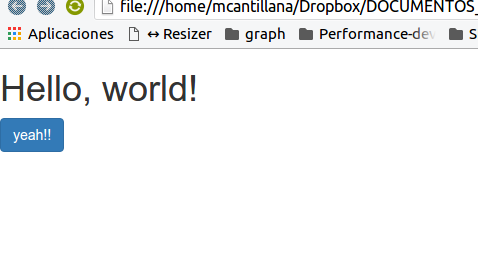

# Instalación de bootstrap 3

Para utilizar bootstrap, existen diferentes mecanismos de instalación. En la presente guía se describirá una de las varias formas de instalación que bootstrap nos ofrece.

## Proceso de instalación
Primero debemos descargar los archivos fuentes de bootstrap. Para ello hacemos click en el siguiente [enlace](https://github.com/twbs/bootstrap/releases/download/v3.3.7/bootstrap-3.3.7-dist.zip) 

El archivo lo deben guardar en alguna carpeta de tu computador. Para esta guía la nombraremos bootstrap_demo. Dentro de la carpeta debemos dejar el fichero comprimido que descargamos, luego lo debemos descomprimir quedando la siguiente estructura de directorios.

```
bootstrap_demo/
├── css/
│   ├── bootstrap.css
│   ├── bootstrap.css.map
│   ├── bootstrap.min.css
│   ├── bootstrap.min.css.map
│   ├── bootstrap-theme.css
│   ├── bootstrap-theme.css.map
│   ├── bootstrap-theme.min.css
│   └── bootstrap-theme.min.css.map
├── js/
│   ├── bootstrap.js
│   └── bootstrap.min.js
└── fonts/
    ├── glyphicons-halflings-regular.eot
    ├── glyphicons-halflings-regular.svg
    ├── glyphicons-halflings-regular.ttf
    ├── glyphicons-halflings-regular.woff
    └── glyphicons-halflings-regular.woff2
``` 

## Configuración template básico
Ahora debemos crear un archivo nuevo que lo nombraremos __index.html__ (puede ser cualquier nombre). 

Debemos abrir el archivo nuevo con nuestro editor de texto sublime text. En el contenido del archivo __index.html__ debemos copiar y pegar el siguiente contenido.

```html
<!DOCTYPE html>
<html lang="en">
  <head>
    <meta charset="utf-8">
    <meta http-equiv="X-UA-Compatible" content="IE=edge">
    <meta name="viewport" content="width=device-width, initial-scale=1">
    <!-- The above 3 meta tags *must* come first in the head; any other head content must come *after* these tags -->
    <title>Bootstrap 101 Template</title>

    <!-- Bootstrap -->
    <link href="css/bootstrap.min.css" rel="stylesheet">

    <!-- HTML5 shim and Respond.js for IE8 support of HTML5 elements and media queries -->
    <!-- WARNING: Respond.js doesn't work if you view the page via file:// -->
    <!--[if lt IE 9]>
      <script src="https://oss.maxcdn.com/html5shiv/3.7.3/html5shiv.min.js"></script>
      <script src="https://oss.maxcdn.com/respond/1.4.2/respond.min.js"></script>
    <![endif]-->
  </head>
  <body>
    <h1>Hello, world!</h1>

    <!-- jQuery (necessary for Bootstrap's JavaScript plugins) -->
    <script src="https://ajax.googleapis.com/ajax/libs/jquery/1.12.4/jquery.min.js"></script>
    <!-- Include all compiled plugins (below), or include individual files as needed -->
    <script src="js/bootstrap.min.js"></script>
  </body>
</html>
```

Este contenido representa **Basic template** de bootstrap y será nuestro punto de partida.

___¿Cómo podemos saber si bootstrap se instaló de forma correcta?___

Entre la etiquetas <body>  y </body> agregar <input type="button" value="Funciono!!" class="btn btn-primary">

Si nos aparece lo siguiente



it's work!